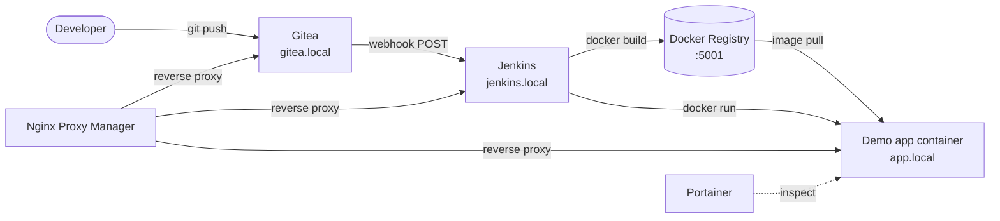
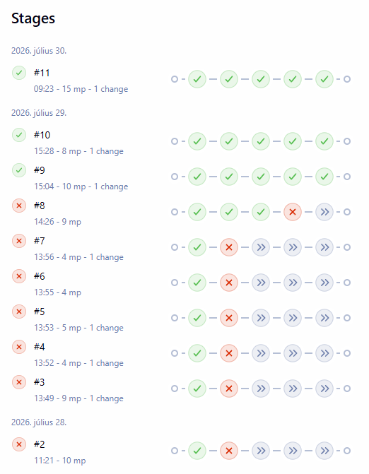

# Docker CI/CD Demo

> A fully reproducible, single-VM CI/CD platform - Gitea, Jenkins, Docker Registry, Nginx Proxy Manager and Portainer - where a `git push` builds, publishes and redeploys a containerized application automatically.


## Overview

This repository provisions a complete, self-hosted CI/CD platform inside a single Vagrant virtual machine. One `vagrant up` creates an Ubuntu 24.04 VM, installs Docker Engine, and starts five platform services with Docker Compose.

Once the platform is configured, pushing a commit to the demo application repository in Gitea triggers a Jenkins pipeline that builds a Docker image, pushes it to a private registry, and replaces the running application container - all on the same VM.

The project is built as a *walking skeleton*: each layer is completed and verified end to end before the next one is added. It is intended as a portfolio and learning environment, not as a production platform.

## What This Project Demonstrates

- **Infrastructure as Code** - the entire environment is defined by `Vagrantfile`, `scripts/provision.sh` and `docker-compose.yml`. The VM can be destroyed and rebuilt from scratch.
- **Idempotent provisioning** - the shell provisioner guards every step, so `vagrant provision` can be re-run safely.
- **A custom CI image** - Jenkins is built from a project `Dockerfile` that adds the Docker CLI and Maven, and aligns the container's `docker` group GID with the mounted socket at runtime.
- **Docker-outside-of-Docker (DooD)** - Jenkins drives the VM's Docker daemon through the mounted socket instead of running a nested daemon.
- **Webhook-driven delivery** - a Gitea push webhook starts the Jenkins pipeline through the Generic Webhook Trigger plugin.
- **A private image registry** - built images are versioned by build number and stored in a local registry behind HTTP basic authentication.
- **Reverse-proxy routing** - Nginx Proxy Manager maps friendly local domains onto container ports over the internal Docker network.
- **Separation of platform and application** - infrastructure and application code live in two independent repositories with independent lifecycles.

## Architecture at a Glance



Everything above runs inside one VirtualBox VM at `192.168.56.10`. The five platform services are defined in `docker-compose.yml` and share the `cicd_net` bridge network. The demo application container is **not** part of the Compose file - Jenkins creates it at deploy time and attaches it to the same network.

The pipeline defined in the application `Jenkinsfile` runs four stages:

```text
Checkout → Build image → Push image → Deploy container
```

See [docs/architecture.md](docs/architecture.md) for the component breakdown, network and persistence model, and the reasoning behind the design decisions.

## Repository Model

The project is deliberately split into two repositories:

| Repository            | Contents                                                                                       | Location            |
| --------------------- | ---------------------------------------------------------------------------------------------- | ------------------- |
| **Platform** (this)   | `Vagrantfile`, `docker-compose.yml`, provisioning script, custom Jenkins image, docs            | GitHub (public)     |
| **Demo application**  | `index.html`, `Dockerfile`, `Jenkinsfile`                                                       | Gitea, inside the VM |

This mirrors a realistic organizational split: infrastructure and application code have separate lifecycles and separate permissions, and the platform repository can be published without exposing application code.

A seed copy of the demo application lives under `demo/nginx-static-site/`. Provisioning copies it to `/home/vagrant/nginx-static-site` inside the VM, from where it is pushed into Gitea during setup.

## Prerequisites

| Tool       | Minimum version | Notes                                       |
| ---------- | --------------- | ------------------------------------------- |
| VirtualBox | 7.0+            |                                             |
| Vagrant    | 2.3+            |                                             |
| Git        | 2.x             |                                             |

- At least **4 GB of free RAM** for the VM, plus room for the host operating system.
- Permission to edit the hosts file on the host machine, to resolve the local demo domains.
- On Windows, Hyper-V must be disabled when using VirtualBox.

Docker is **not** required on the host machine - the provisioning script installs Docker Engine and the Compose plugin inside the VM.

## Quick Start

### 1. Clone the repository

```bash
git clone https://github.com/bwgabor/docker-cicd-demo.git
cd docker-cicd-demo
```

### 2. Create the environment file

```bash
cp .env.example .env
```

Review `.env` before the first start. At minimum, set the initial Nginx Proxy Manager administrator credentials. `.env` is git-ignored and must not be committed.

### 3. Add the local domains to your hosts file

Map every demo domain to the VM address on the machine you browse from:

```text
192.168.56.10 gitea.local
192.168.56.10 jenkins.local
192.168.56.10 portainer.local
192.168.56.10 npm.local
192.168.56.10 app.local
```

Full instructions for Windows, Linux and macOS are in [docs/platform-setup.md](docs/platform-setup.md#host-name-resolution).

### 4. Start the virtual machine

```bash
vagrant up
```

The first run takes roughly 10 minutes: it creates the Ubuntu VM, installs Docker, builds the custom Jenkins image, and starts the stack.

### 5. Configure the platform

Follow [docs/platform-setup.md](docs/platform-setup.md) to create the Nginx Proxy Manager proxy hosts, generate the registry `htpasswd` file, and initialize Portainer.

### 6. Configure Gitea and Jenkins

Follow [docs/jenkins-gitea-setup.md](docs/jenkins-gitea-setup.md) to create the Gitea administrator account and application repository, complete the Jenkins setup wizard, create the pipeline job and credentials, and wire up the push webhook.

That guide ends by pushing the demo application to Gitea, which triggers the first automated pipeline run.

## Verify the Pipeline

After setup, change `index.html` in the demo application repository inside the VM and push it:

```bash
vagrant ssh
cd /home/vagrant/nginx-static-site
# edit index.html
git commit -am "test: verify webhook-triggered pipeline"
git push origin main
```

Gitea delivers the webhook, Jenkins starts a build, and every stage should complete:



The stage view above is the real build history of this project rather than a single clean run, because the failures are the more useful part of it. Each red stage marks a genuine integration problem that had to be found and fixed:

| Failing stage    | Problem                                                                   | Fix                                                                     |
| ---------------- | ------------------------------------------------------------------------- | ----------------------------------------------------------------------- |
| `Checkout`       | Jenkins requested `refs/heads/master` while the repository used `main`     | Pinned `main` in both the job's branch specifier and the `Jenkinsfile`   |
| `Push image`     | The registry rejected the push because the pipeline was not authenticated  | Added a `docker login` step using the `registry-creds` credential        |

Once both were resolved, the pipeline ran green on consecutive pushes. The leftmost node in each row is the implicit `Declarative: Checkout SCM` stage that Jenkins adds for *Pipeline script from SCM* jobs; the four stages defined in the `Jenkinsfile` follow it.

Reload `http://app.local` on the host machine - the page should show your change. A full console transcript of a successful run is available in [docs/pipeline-log.txt](docs/pipeline-log.txt).

This confirms the complete delivery path:

```text
Gitea push → Jenkins webhook → Pipeline → Image build → Registry push → Container deployment
```

## Service Endpoints

All host names resolve to `192.168.56.10`. Ports are configurable in `.env`.

| Endpoint                 | Service                    | Reached through           |
| ------------------------ | -------------------------- | ------------------------- |
| `http://gitea.local`     | Gitea web UI               | Nginx Proxy Manager       |
| `http://jenkins.local`   | Jenkins web UI             | Nginx Proxy Manager       |
| `http://portainer.local` | Portainer dashboard        | Nginx Proxy Manager       |
| `http://app.local`       | Demo application           | Nginx Proxy Manager       |
| `http://npm.local:81`    | Nginx Proxy Manager admin  | Published VM port         |
| `localhost:5001`         | Docker Registry API        | Published VM port, inside the VM |
| `192.168.56.10:222`      | Gitea SSH                  | Published VM port         |

Credentials are not listed here. Each account is created during setup - Nginx Proxy Manager reads its initial administrator from `.env`, Gitea, Jenkins and Portainer are created through their setup wizards, and the registry credentials are generated into `config/registry/htpasswd`. The setup guides describe each one.

## Documentation

| Document                                                   | Contents                                                                                |
| ---------------------------------------------------------- | --------------------------------------------------------------------------------------- |
| [Architecture](docs/architecture.md)                        | Component model, network and persistence, CI/CD flow, design decisions                  |
| [Platform Setup](docs/platform-setup.md)                    | Host name resolution, proxy hosts, registry authentication, Portainer, troubleshooting  |
| [Jenkins and Gitea Setup](docs/jenkins-gitea-setup.md)      | Gitea initialization, Jenkins wizard, plugins, credentials, pipeline job, push webhook  |

## Security and Scope Limitations

This is a local demonstration environment. Its default configuration is not suitable for production or for exposure to the public Internet.

- **No TLS.** All traffic is plain HTTP, including the Docker Registry, which requires an `insecure-registries` entry in the Docker daemon configuration.
- **Docker socket access.** Jenkins and Portainer both mount `/var/run/docker.sock`. This grants each container effective administrative control over the VM's Docker daemon.
- **Secrets are local.** Tokens, the webhook token and the registry `htpasswd` file stay on the VM. `.env`, `config/registry/htpasswd` and token files are git-ignored and must never be committed.
- **No high availability or backups.** Data lives in named Docker volumes on a single VM. Destroying the VM or its volumes discards Gitea repositories, Jenkins jobs and registry images.
- **Single-node scope.** There is no cluster, no agent fleet and no multi-environment promotion.

## Future Improvements

- Ansible playbook to replace the shell provisioner and automate the manual UI setup steps
- Trivy image vulnerability scanning as a pipeline stage
- Multibranch pipeline driven by the Gitea plugin instead of a single-branch job
- TLS termination in Nginx Proxy Manager with a local certificate authority
- Migration to K3s to demonstrate a Kubernetes deployment target
- `vagrant-hostmanager` integration so that host name entries are managed automatically
