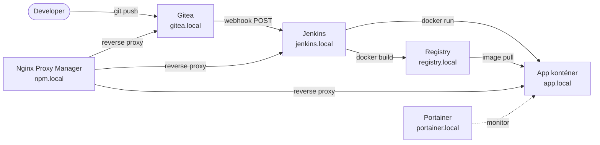

# Docker CI/CD Pipeline Demo

> Lokális, konténerizált CI/CD platform: Gitea + Jenkins + Docker Registry + Nginx Proxy Manager + Portainer — egyetlen `vagrant up` paranccsal reprodukálható.


---

## Architektúra



---

## Stack

| Service             | Image                      | Domain            | Funkció                       |
| ------------------- | -------------------------- | ----------------- | ----------------------------- |
| Gitea               | `gitea/gitea:latest`       | `gitea.local`     | Self-hosted Git szerver       |
| Jenkins             | egyedi (LTS + Docker CLI)  | `jenkins.local`   | CI/CD szerver                 |
| Docker Registry     | `registry:2`               | `registry.local`  | Privát image store            |
| Nginx Proxy Manager | `jc21/nginx-proxy-manager` | `npm.local`       | Reverse proxy, domain routing |
| Portainer           | `portainer/portainer-ce`   | `portainer.local` | Konténer dashboard            |
| Demo App            | egyedi Nginx image         | `app.local`       | Statikus HTML weboldal        |

---

## Két-repo modell

A projekt szándékosan két külön repóra van bontva:

| Repo                   | Tartalom                                              | Hol él                         |
| ---------------------- | ----------------------------------------------------- | ------------------------------ |
| **Platform repo** (ez) | Vagrantfile, docker-compose, docs, Jenkins Dockerfile | GitHub (publikus)              |
| **App repo**           | index.html, Dockerfile, Jenkinsfile                   | Gitea (lokális, a VM-en belül) |

**Miért?** Ez tükrözi a valóságos szervezeti modellt: az infrastruktúra és az alkalmazás külön életciklussal rendelkezik, külön jogosultságokkal kezelhető, és a platform repo GitHub-on publikálható anélkül, hogy az app kód is kikerülne.

---

## Előfeltételek

| Eszköz     | Minimum verzió |
| ---------- | -------------- |
| VirtualBox | 7.0+           |
| Vagrant    | 2.3+           |
| Git        | 2.x            |

> **Windows:** Hyper-V legyen kikapcsolva, ha VirtualBox-ot használsz.

---

## Quick Start

### 1. Repo klónozása

```bash
git clone https://github.com/<user>/docker-cicd-demo.git
cd docker-cicd-demo
```

### 2. Környezeti változók beállítása

```bash
cp .env.example .env
# Szerkeszd a .env fájlt: registry jelszó, Gitea admin adatok stb.
```

### 3. /etc/hosts bejegyzések

Lásd: [docs/setup-hosts.md](docs/setup-hosts.md)

### 4. VM indítása

```bash
vagrant up
```

Az első futtatás ~10 percet vesz igénybe (Ubuntu + Docker + Compose pull).

### 5. Initial setup

A stack elindulása után sorban el kell végezni:

1. **Jenkins wizard** → `jenkins.local` → lásd [docs/jenkins-setup.md](docs/jenkins-setup.md)
2. **Gitea inicializálás** → `gitea.local` → admin user létrehozása, app repo felpusholása
3. **Nginx Proxy Manager** → `npm.local` → proxy host-ok beállítása
4. **Portainer** → `portainer.local` → admin setup

### 6. App repo felpusholása Gitea-ba

```bash
cd demo/nginx-static-site
git init
git remote add origin http://gitea.local/<user>/nginx-static-site.git
git add .
git commit -m "Initial commit"
git push -u origin main
```

### 7. Első pipeline futtatás

Jenkins-ben a `nginx-static-site-pipeline` jobon: **Build Now** → pipeline végigfut → app elérhető: `http://app.local`

Ezután minden `git push` automatikusan triggereli a pipeline-t a Gitea webhook-on keresztül.

---

## Service elérhetőségek

| Domain            | Szolgáltatás           | Demo belépési adatok              |
| ----------------- | ---------------------- | --------------------------------- |
| `gitea.local`     | Gitea UI               | `gitea-admin` / `admin123`        |
| `jenkins.local`   | Jenkins UI             | `admin` / `admin123`              |
| `registry.local`  | Docker Registry        | `registry-user` / `registry-pass` |
| `portainer.local` | Portainer dashboard    | `admin` / `admin123456`           |
| `npm.local`       | Nginx Proxy Manager UI | `admin@example.com` / `changeme`  |
| `app.local`       | Demo weboldal          | —                                 |

> ⚠️ Ezek demo értékek, lokális fejlesztési környezethez. Éles használathoz változtasd meg az összes jelszót.

---

## Ismert korlátok

- A Docker Registry HTTP-n fut (`insecure-registries` konfiguráció szükséges)
- Az `/etc/hosts` fájlt manuálisan kell szerkeszteni minden hoston
- Nem production-ready: nincs TLS, nincs HA, nincs backup
- Jenkins Docker socket megosztás (DooD): lokális demóban elfogadható, élesben kerülendő

---

## Lehetséges továbbfejlesztések

- Ansible playbook a teljes provisioning automatizáláshoz
- K3s migráció (Kubernetes)
- Trivy image vulnerability scanning a pipeline-ban
- vagrant-hostmanager plugin az automatikus hosts kezeléshez
- Multi-branch pipeline Gitea-ban