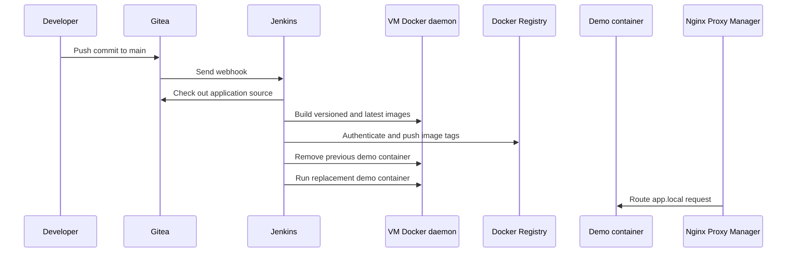

# Architecture

## Purpose and Scope

This document describes the architecture of the Docker CI/CD Demo platform and the design decisions behind it.

The project provides a fully reproducible, local CI/CD environment for portfolio and learning purposes. A Vagrant-managed Ubuntu virtual machine hosts a Docker Compose stack that provides source control, continuous integration, a private container registry, reverse proxying, and optional container management.

The core workflow starts with a push to a Gitea repository and ends with an updated demo application available at `app.local`. Jenkins builds the application image, publishes it to the private registry, and replaces the running application container on the same virtual machine.

The platform is intentionally scoped as a single-VM demonstration environment. It does not aim to provide a production-ready, highly available, or Internet-facing deployment platform.

---

## System Overview

The host machine runs a VirtualBox virtual machine managed by Vagrant. The VM uses a fixed private IP address, `192.168.56.10`, and runs the platform services as Docker containers connected to the `cicd_net` bridge network.

```mermaid
flowchart TB
    Developer[Developer on host machine]
    Browser[Browser]

    subgraph Host["Host machine"]
        Developer
        Browser

        subgraph VM["Vagrant / VirtualBox VM - Ubuntu 24.04 - 192.168.56.10"]
            subgraph Network["Docker network: cicd_net"]
                Gitea[Gitea<br/>Source control]
                Jenkins[Jenkins<br/>CI/CD automation]
                Registry[Docker Registry<br/>Private image storage]
                NPM[Nginx Proxy Manager<br/>Reverse proxy]
                Portainer[Portainer<br/>Optional management UI]
                App[Demo application<br/>Runtime container]
            end

            DockerDaemon[VM Docker daemon]
        end
    end

    Developer -->|git push| Gitea
    Gitea -->|webhook| Jenkins
    Jenkins -->|Docker socket| DockerDaemon
    DockerDaemon -->|build and push image| Registry
    DockerDaemon -->|replace container| App
    Browser -->|HTTP: app.local| NPM
    NPM -->|proxy request| App
```

The demo application is not part of the platform Docker Compose file. It is built and started as a separate runtime container by the Jenkins pipeline after a push to the Gitea repository. Nginx Proxy Manager exposes this container through the `app.local` hostname.

---

## Components

| Component           | Responsibility                                                                                                                     | Persistence                   | Access                        |
| ------------------- | ---------------------------------------------------------------------------------------------------------------------------------- | ----------------------------- | ----------------------------- |
| Gitea               | Hosts the demo application source repository and sends webhooks to Jenkins after a push.                                           | `gitea_data`                  | Web UI and SSH                |
| Jenkins             | Runs the CI/CD pipeline: builds the application image, pushes it to the private registry, and recreates the application container. | `jenkins_data`                | Web UI                        |
| Docker Registry     | Stores versioned demo application images produced by Jenkins.                                                                      | `registry_data`               | Docker Registry API           |
| Nginx Proxy Manager | Provides reverse proxy routes from hostnames to services running inside the Docker network.                                        | `npm_data`, `npm_letsencrypt` | Admin UI and HTTP/HTTPS proxy |
| Portainer           | Provides an optional web UI for inspecting and managing Docker resources on the VM.                                                | `portainer_data`              | HTTPS web UI                  |
| Demo application    | A separate runtime container built and deployed by Jenkins; it is not defined in the platform Compose file.                        | Image stored in Registry      | `app.local`                   |

All platform services are defined in `docker-compose.yml` and run on the `cicd_net` bridge network. The demo application is created by the Jenkins pipeline and joins the same network so that Nginx Proxy Manager can route requests to it.

Jenkins uses Docker-outside-of-Docker (DooD): the Jenkins container has access to the VM Docker daemon through the mounted `/var/run/docker.sock`. This allows the pipeline to build images, push them to the local registry, and manage the separate demo application container without running a nested Docker daemon.

---

## Network and Persistence

The platform is deployed inside a Vagrant-managed VirtualBox VM with the fixed private IP address `192.168.56.10`. The host machine reaches platform services through this VM address, either through published ports or through local host name resolution and Nginx Proxy Manager.

All platform containers use the `cicd_net` Docker bridge network. This provides internal service discovery through Docker service and container names, such as `gitea`, `jenkins`, and `registry`. These internal names are used for container-to-container communication; the `*.local` hostnames are intended for access from the host machine.

| Layer               | Network responsibility                                                                                         |
| ------------------- | -------------------------------------------------------------------------------------------------------------- |
| Host machine        | Resolves local `*.local` hostnames to the VM IP address and accesses published service ports.                  |
| Vagrant VM          | Hosts Docker Engine, the Docker Compose stack, persistent volumes, and the runtime demo application container. |
| `cicd_net`          | Connects platform containers and the runtime demo application container inside Docker.                         |
| Nginx Proxy Manager | Receives host-side HTTP requests and forwards them to target containers on `cicd_net`.                         |

The following named volumes preserve state independently from the container lifecycle:

| Volume            | Stored data                                                            |
| ----------------- | ---------------------------------------------------------------------- |
| `gitea_data`      | Gitea repositories, users, configuration, and SQLite database data.    |
| `jenkins_data`    | Jenkins configuration, plugins, credentials, jobs, and build metadata. |
| `registry_data`   | Docker image layers and metadata stored by the private registry.       |
| `npm_data`        | Nginx Proxy Manager configuration and database data.                   |
| `npm_letsencrypt` | Nginx Proxy Manager certificate-related data.                          |
| `portainer_data`  | Portainer configuration and local user data.                           |

The Registry also mounts the host directory `./config/registry` into the container at `/auth`. This directory stores the `htpasswd` file used for Registry authentication and is versioned separately from Docker named volumes.

Published host ports are configured through environment variables in `.env`. This keeps the Compose file reusable while allowing the default ports to be changed without editing service definitions. The authoritative values for domains, port mappings, image versions, and initial demo credentials are documented in `.env.example`.

---

## Repository Model

The project uses a two-repository model to separate platform infrastructure from application source code.

| Repository                  | Location            | Contents                                                                                                                                                               | Lifecycle                                                       |
| --------------------------- | ------------------- | ---------------------------------------------------------------------------------------------------------------------------------------------------------------------- | --------------------------------------------------------------- |
| Platform repository         | GitHub              | `Vagrantfile`, `docker-compose.yml`, provisioning script, custom Jenkins image, configuration templates, documentation, and a local seed copy of the demo application. | Maintained as the reproducible infrastructure definition.       |
| Demo application repository | Gitea inside the VM | `index.html`, `Dockerfile`, and `Jenkinsfile` for the nginx demo application.                                                                                          | Changed by application commits that trigger the CI/CD pipeline. |

The platform repository is intentionally public and acts as the reproducible entry point for the complete environment. It contains the demo application files under `demo/nginx-static-site` only as seed content for the initial setup.

During provisioning, these seed files are copied to `/home/vagrant/nginx-static-site` in the VM. The operator initializes that directory as a Git repository and pushes it to Gitea. From that point, Gitea is the source of truth for application changes, and pushes to this repository trigger the Jenkins pipeline.

This separation mirrors a common operational boundary: platform configuration can evolve independently from application code, and the platform can be documented and shared without requiring the application repository to be publicly hosted.

---

## CI/CD Flow

The demo application pipeline is defined by the `Jenkinsfile` stored in the Gitea application repository. A push to the `main` branch triggers the Jenkins job through a Gitea webhook.

1. A developer changes the demo application and pushes the commit to the Gitea repository.
2. Gitea sends a webhook request to Jenkins.
3. Jenkins checks out the `main` branch from Gitea using the internal `gitea` service name.
4. Jenkins builds two Docker image tags: a build-specific tag using the Jenkins build number and the `latest` tag.
5. Jenkins authenticates to the private registry using the `registry-creds` Jenkins credential and pushes both image tags to `127.0.0.1:5001`.
6. Jenkins removes the previous `demo` container if it exists.
7. Jenkins starts a replacement `demo` container from the `latest` image, connects it to `docker-cicd-demo_cicd_net`, and publishes container port `80` on VM port `8880`.
8. Nginx Proxy Manager exposes the deployed application through the `app.local` hostname.

The pipeline uses `127.0.0.1:5001` as the Registry endpoint. Because Docker commands executed by Jenkins are handled by the VM Docker daemon through the mounted socket, this loopback address resolves on the VM, where the Registry port is published. The Docker daemon is configured to allow the local demo Registry through the `registry.local`, `registry:5001`, and `localhost:5001` insecure-registry entries.

The pipeline uses the mounted Docker socket rather than a Docker daemon running inside Jenkins. Therefore, image build, registry interaction, and container lifecycle operations are performed by the Docker Engine running on the Vagrant VM.

---

## Design Decisions

| Decision                                           | Rationale                                                                                                                                      |
| -------------------------------------------------- | ---------------------------------------------------------------------------------------------------------------------------------------------- |
| Vagrant and VirtualBox                             | Provides an isolated and repeatable single-VM environment that can be provisioned from a platform repository.                                  |
| Docker Compose                                     | Keeps the platform services declarative, lightweight, and easy to inspect without requiring a cluster orchestrator.                            |
| Separate platform and application repositories     | Separates infrastructure lifecycle from application lifecycle and allows application pushes to act as the CI/CD trigger.                       |
| Gitea                                              | Provides a lightweight, self-hosted Git service suitable for a local demonstration environment.                                                |
| Jenkins                                            | Demonstrates an explicit, configurable CI/CD pipeline with build, registry publication, deployment, and webhook triggering.                    |
| Custom Jenkins image with Docker-outside-of-Docker | Gives Jenkins controlled access to the VM Docker daemon through the Docker socket, enabling image builds and application container deployment. |
| Private Docker Registry                            | Keeps generated application images inside the local platform and demonstrates a complete build-to-artifact workflow.                           |
| Nginx Proxy Manager                                | Provides a UI-managed reverse proxy layer and friendly hostnames for host-side browser access.                                                 |
| Portainer as an optional component                 | Adds visibility into Docker resources without becoming a dependency of the CI/CD workflow.                                                     |
| Idempotent provisioning script                     | Allows `vagrant provision` to be run again with guarded installation, image build, stack startup, and seed-file setup steps.                   |

The environment deliberately favors clarity and reproducibility over production complexity. It is designed to demonstrate the lifecycle of a containerized application from source commit to a running container, while keeping the infrastructure small enough to run on a local workstation.

---

## Security and Demo Limitations

This project is designed for local learning and portfolio demonstration. It is not intended for production use without additional security, reliability, and operational controls.

- Default credentials in `.env.example` are placeholders for local setup only. Replace them before starting the environment, and never commit a populated `.env` file.
- The Docker Registry uses HTTP and is configured as an insecure registry for the local VM. This is acceptable only within the isolated demo environment; a production registry must use TLS and a properly managed certificate.
- Jenkins uses Docker-outside-of-Docker through the mounted `/var/run/docker.sock`. Access to this socket effectively grants high-level control over the VM Docker daemon and must be treated as privileged access.
- Nginx Proxy Manager exposes HTTP and HTTPS ports, but the project does not configure publicly trusted TLS certificates or Internet-facing DNS.
- Gitea registration is enabled to simplify local initial setup. In a shared or production environment, registration should be disabled and user access controlled.
- The platform runs on one VM and has no high availability, backup strategy, disaster recovery process, central logging, monitoring stack, or secrets manager.
- The demo application is intentionally minimal and does not include application-level authentication, tests, vulnerability scanning, or image signing.

These limitations are intentional. They keep the project focused on demonstrating a reproducible local CI/CD workflow rather than simulating a complete production platform.
